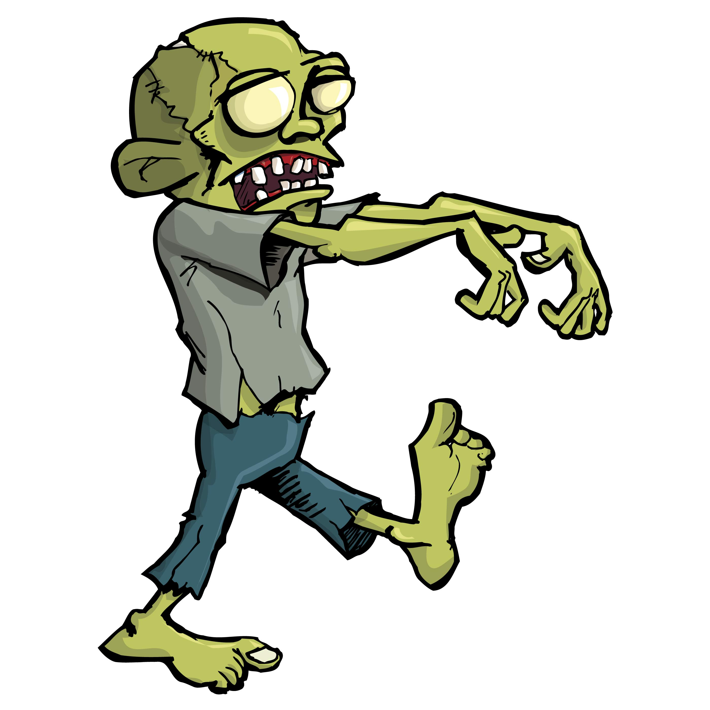

# Python for zombies

## fmasanori@gmail.com

---

# Objectives of the course

What will we learn?

 - Programming in Python
 - More precisely, learn the logic of programming
 - This is the basis for everything else: web development, games, etc...
 
Who is the course for?

 - Beginners == zombies
 - It's enough to have Python installed and you can start learning new things

---
